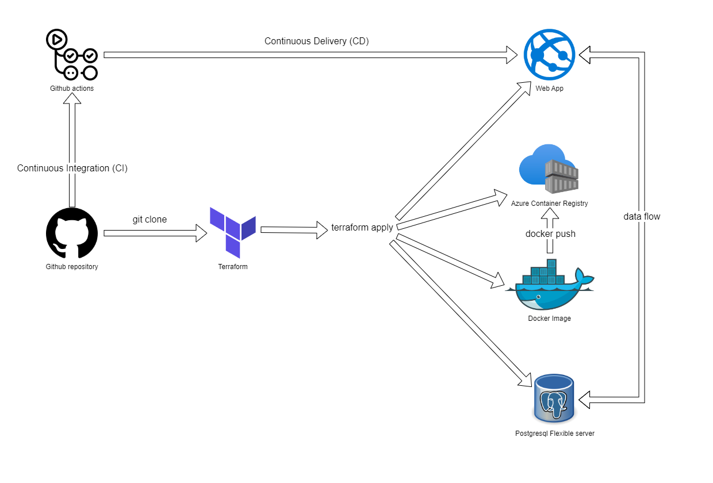
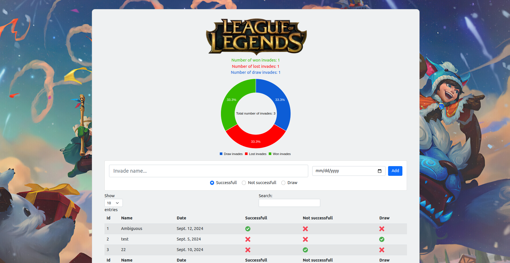
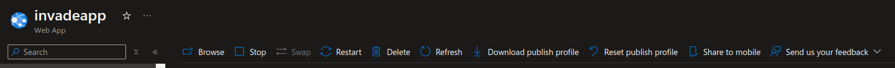
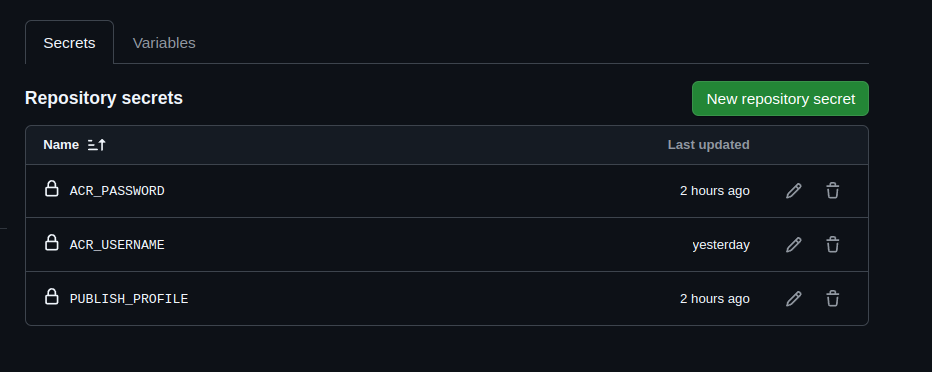

# Invade Application
## Description

This project is a small application written in Django which is deployed automatically on Cloud (Azure) with DevOps tools. The purpose of this application is to track a certain aspect of one popular computer game. The main goal of this project was to train the deployment of web applications, containerization, infrastructure as code or CI/CD processes.


## Application stack
* Backend: Django (Python)
* Container: Docker (Azure Container Registry)
* Database: PostgreSQL
* Cloud: Azure (Web App + PostgreSQL flexible server)
* Infrastructure as Code: Terraform
* CI/CD: Github Actions

## Project Schema

Terraform is handling infrastructure creation and application deployment. At the beggining terraform uses docker commands to build, tag and push image to Azure Container Registry (which is also created by tf earlier). After that, Web App is created with image from ACR and connected to the Postgresql database. 



## Prerequisites
Make sure you have installed all of the following prerequisites on your development machine:
* Git - [Download & Install Git](https://git-scm.com/downloads). OSX and Linux machines typically have this already installed.
* Terraform (version 1.9.5) - [Download & Install Terraform](https://developer.hashicorp.com/terraform/install)
* Docker Engine - [Download & Install Docker Engine](https://docs.docker.com/engine/install/)

## Application starting
* Log in to Azure

    ```
        az login --tenant <your_tenant_id> --use-device-code
    ```
* Set your subscrpiton ID in main.tf file

    ```ruby
        # Configure the Microsoft Azure Provider
        provider "azurerm" {
        subscription_id = "<your_subscription_id>"
        features {}
        }
    ```
* Create infrastructure, build application and deploy it to the Web App

    ```
        terraform init
        terraform apply -auto-approve
    ```

* You can specify database credentials using terraform.tfvars file
* You should see application hosted on address https://invadeapp.azurewebsites.net/



## Enable CI/CD with Github Actions
* In order to enable CI/CD you need to need to set up 3 secrets in Github respository
    - ACR_USERNAME
    - ACR_PASSWORD
    - PUBLISH_PROFILE

* You can get ACR_USERNAME and ACR_PASSWORD using following commands
    ```
        terraform output acr_admin_username
        terraform output acr_admin_password
    ```
* You can receive PUBLISH_PROFILE value by clicking "Download publish profile" in Web App blade



* Add secrets mentioned above and you ready to go!




